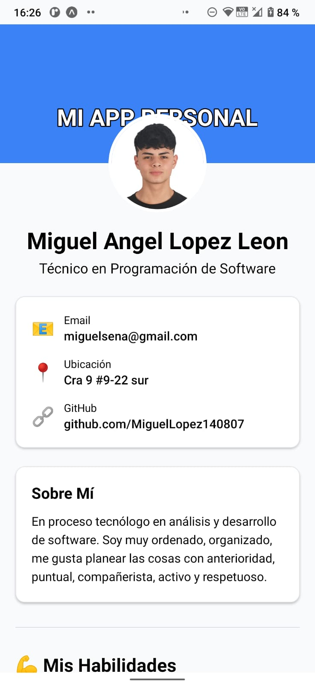
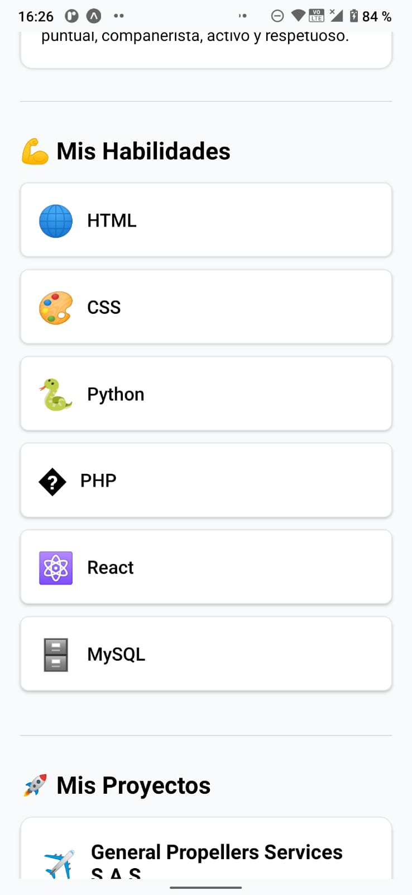
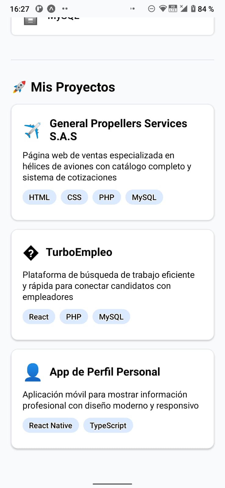

# 📱 Mi App Personal - React Native

## 🎬 Demostración en Video

[](https://drive.google.com/file/d/1PhyLf5SlkAsB1U7xRy4rGVnFj-KgoI6P/view?usp=sharing)

> **¡Haz clic en el botón de arriba para ver la aplicación en funcionamiento!** 📱✨
> 
> El video muestra todas las funcionalidades de la aplicación incluyendo navegación, interfaz de usuario y tu información personal.

---

## 👨‍💻 Información del Desarrollador
**Desarrollado por:** Miguel Angel Lopez Leon  
**Fecha:** 16 de octubre de 2025  
**Título:** Técnico en Programación de Software  
**En proceso:** Tecnólogo en Análisis y Desarrollo de Software  

---

## 🌿 Organización del Proyecto por Ramas

Este repositorio está organizado en **ramas separadas** para cada práctica del curso, permitiendo una entrega y revisión organizada:

### 📋 **Estructura de Ramas:**

| Rama | Descripción | Estado | Enlace Directo |
|:-----|:-----------|:-------|:--------------|
| **`main`** | 🏠 Proyecto principal completo con todas las funcionalidades | ✅ **Completo** | [Ver rama main](https://github.com/MiguelLopez140807/bc-reactnative-semana01-proyecto/tree/main) |
| **`practica-1`** | 📱 Perfil personal básico (Header + Avatar + Contacto + Sobre Mí) | ✅ **Entregado** | [Ver práctica 1](https://github.com/MiguelLopez140807/bc-reactnative-semana01-proyecto/tree/practica-1) |
| **`practica-2`** | 🔄 Componente Card reutilizable con TypeScript y 3 variantes | ✅ **Entregado** | [Ver práctica 2](https://github.com/MiguelLopez140807/bc-reactnative-semana01-proyecto/tree/practica-2) |
| **`practica-3`** | 🎯 Tercera práctica del curso | 🚧 **Pendiente** | *Por desarrollar* |

### 🎯 **Ventajas de esta Organización:**

- ✅ **Separación clara** de cada entrega
- ✅ **Fácil revisión** por práctica individual
- ✅ **Historial completo** de cada implementación
- ✅ **Proyecto principal seguro** en la rama main
- ✅ **Navegación sencilla** entre versiones

### 📖 **Para Profesores - Cómo Revisar:**

1. **Proyecto Completo:** Revisar rama `main` para ver la aplicación final
2. **Práctica Específica:** Cambiar a la rama correspondiente (ej: `practica-1`)
3. **Comparar Versiones:** Usar las herramientas de GitHub para comparar ramas
4. **Código Fuente:** El archivo principal siempre es `App.tsx` en cada rama

---

## 📋 Descripción del Proyecto

Mi App Personal es una aplicación móvil desarrollada con React Native y Expo que muestra mi información profesional de manera elegante y moderna. La aplicación presenta mi perfil, habilidades técnicas y proyectos realizados.

### ✨ Características Principales
- 📱 Diseño responsivo y moderno
- 👤 Perfil personal completo
- 💪 Sección de habilidades técnicas
- 🚀 Portafolio de proyectos
- 📞 Información de contacto
- 🎨 Interfaz intuitiva y profesional

---

## 📸 Screenshots

| Perfil Personal | Habilidades | Proyectos |
|:--------------:|:-----------:|:---------:|
|  |  |  |

> **Nota:** Para tomar screenshots de la aplicación:
> 1. Ejecuta `pnpm start` o `expo start`
> 2. Abre la app en tu dispositivo móvil con Expo Go
> 3. Toma capturas de pantalla de las diferentes secciones
> 4. Guarda las imágenes en la carpeta `screenshots/` con los nombres correspondientes

---

## 🛠️ Tecnologías Utilizadas

- **React Native** - Framework principal
- **Expo** - Plataforma de desarrollo
- **TypeScript** - Tipado estático
- **React Native StyleSheet** - Estilos nativos
- **Expo Status Bar** - Gestión de la barra de estado
- **React Native Safe Area Context** - Áreas seguras

---

## 📦 Instalación y Configuración

### Prerrequisitos
- Node.js (versión 16 o superior)
- pnpm (gestor de paquetes)
- Expo CLI
- Expo Go (aplicación móvil para pruebas)

### Pasos de Instalación

1. **Clonar el repositorio**
   ```bash
   git clone <url-del-repositorio>
   cd mi-app-personal
   ```

2. **Instalar dependencias**
   ```bash
   pnpm install
   ```

3. **Instalar dependencias específicas de Expo**
   ```bash
   npx expo install react-native-safe-area-context
   pnpm add -D babel-preset-expo
   ```

4. **Cambiar a la rama deseada (opcional)**
   ```bash
   # Para ver el proyecto completo (por defecto)
   git checkout main
   
   # Para ver una práctica específica
   git checkout practica-1    # Ver Práctica 1
   git checkout practica-2    # Ver Práctica 2 (cuando esté disponible)
   git checkout practica-3    # Ver Práctica 3 (cuando esté disponible)
   
   # Ver todas las ramas disponibles
   git branch -a
   ```

5. **Ejecutar la aplicación**
   ```bash
   pnpm start
   ```
   o
   ```bash
   expo start
   ```

6. **Ver en dispositivo móvil**
   - Instala **Expo Go** desde Play Store o App Store
   - Escanea el código QR que aparece en la terminal
   - La aplicación se cargará automáticamente

### Comandos Adicionales

```bash
# Limpiar caché y reiniciar
pnpm start --clear

# Abrir en Android (si tienes emulador)
expo start --android

# Abrir en iOS (si tienes simulador en Mac)
expo start --ios

# Abrir en web
expo start --web
```

---

## 🔧 Decisiones Técnicas y Solución de Problemas

### ⚠️ Problema con NativeWind/Tailwind CSS

Durante el desarrollo inicial, se intentó implementar **NativeWind** (Tailwind CSS para React Native), pero se encontraron problemas de compatibilidad que impedían el correcto funcionamiento de la aplicación.

#### Error Encontrado:
```bash
ERROR  index.ts: [BABEL] C:\Users\USUARIO\mi-app-personal\index.ts: .plugins is not a valid Plugin property
```

#### Análisis del Problema:
- El error ocurría en la configuración de Babel con el plugin `nativewind/babel`
- La versión de NativeWind instalada presentaba incompatibilidades
- El bundler de Metro no podía procesar correctamente los plugins de Babel

#### Solución Implementada:
Se tomó la **decisión técnica** de migrar de **NativeWind** a **React Native StyleSheet nativo** por las siguientes razones:

1. **✅ Estabilidad:** StyleSheet es el sistema de estilos nativo y estable de React Native
2. **✅ Performance:** Mejor rendimiento al no requerir procesamiento adicional de CSS
3. **✅ Compatibilidad:** 100% compatible con todas las versiones de React Native y Expo
4. **✅ Mantenibilidad:** Código más predecible y fácil de mantener
5. **✅ Debugging:** Herramientas de depuración nativas más efectivas

#### Configuración Final de Babel:
```javascript
module.exports = function (api) {
  api.cache(true);
  return {
    presets: ['babel-preset-expo'],
    plugins: [], // Sin plugins adicionales para máxima compatibilidad
  };
};
```

### 🎨 Implementación de Estilos

La migración se realizó manteniendo el **mismo diseño visual** pero utilizando:
- **StyleSheet.create()** para definir estilos
- **Colores hexadecimales** equivalentes a las clases de Tailwind
- **Flexbox nativo** para layouts
- **Sombras y bordes** nativos de React Native

---

## 📁 Estructura del Proyecto

```
mi-app-personal/
├── App.tsx                 # Componente principal
├── babel.config.js         # Configuración de Babel
├── package.json           # Dependencias del proyecto
├── tsconfig.json          # Configuración de TypeScript
├── tailwind.config.js     # Configuración de Tailwind (no utilizada)
├── components/            # Componentes reutilizables
│   ├── SkillCard.tsx      # Tarjeta de habilidades
│   └── ProjectCard.tsx    # Tarjeta de proyectos
├── screenshots/           # Capturas de pantalla
│   ├── perfil.png
│   ├── habilidades.png
│   └── proyectos.png
└── assets/               # Recursos estáticos
```

---

## 📱 Secciones de la Aplicación

### 🏠 Header y Perfil
- Encabezado con gradiente azul
- Avatar circular superpuesto
- Nombre y título profesional

### 📞 Información de Contacto
- Email de contacto
- Ubicación
- Enlaces a GitHub

### ℹ️ Sobre Mí
- Descripción personal y profesional
- Características personales

### 💪 Mis Habilidades
- HTML, CSS, Python
- PHP, React, MySQL
- Tarjetas individuales por tecnología

### 🚀 Mis Proyectos
- General Propellers Services S.A.S
- TurboEmpleo
- App de Perfil Personal
- Tags de tecnologías utilizadas

---

## 🤝 Contribuciones

Este es un proyecto personal, pero las sugerencias y mejoras son bienvenidas. Si encuentras algún error o tienes ideas para mejorar la aplicación, no dudes en crear un issue o pull request.

---

## 📄 Licencia

Este proyecto es de uso personal y educativo.

---

## 📞 Contacto

- **Email:** miguelsena@gmail.com
- **GitHub:** [MiguelLopez140807](https://github.com/MiguelLopez140807)
- **Ubicación:** Cra 9 #9-22 sur

---

## 📚 Detalles de las Prácticas Implementadas

### � **Práctica 1 - Perfil Personal Básico** ✅
- **Objetivo:** Crear un perfil personal con secciones básicas
- **Implementación:** Header, Avatar, Información de contacto, Sobre mí
- **Tecnologías:** React Native, StyleSheet, SafeAreaView
- **Fecha:** 15 de octubre de 2025
- **Rama:** `practica-1`

### 🎯 **Práctica 2 - Componente Card Reutilizable** ✅
- **Objetivo:** Crear un componente reutilizable con TypeScript
- **Implementación:** 
  - Componente `Card.tsx` con interface `CardProps`
  - **3 variantes:** default, featured, compact
  - Props tipadas con TypeScript
  - Estilos nativos condicionales según variante
- **Características:**
  - 📱 **Variante Default:** Fondo blanco, sombras sutiles, botón azul
  - ⭐ **Variante Featured:** Fondo morado, badge destacado amarillo
  - ⚙️ **Variante Compact:** Layout horizontal compacto
- **Tecnologías:** TypeScript interfaces, renderizado condicional, StyleSheet
- **Fecha:** 16 de octubre de 2025
- **Rama:** `practica-2`

### 🎯 **Práctica 3 - Por Definir** 🚧
- **Estado:** Pendiente de implementación
- **Rama:** `practica-3` (por crear)

---

## �🏆 Reflexiones del Desarrollo

Este proyecto representó una excelente oportunidad para:
- Aprender React Native y Expo
- Trabajar con TypeScript en desarrollo móvil
- Resolver problemas técnicos complejos
- Tomar decisiones arquitectónicas importantes
- Documentar el proceso de desarrollo
- Implementar componentes reutilizables con interfaces TypeScript
- Crear documentación técnica profesional

La **migración de NativeWind a StyleSheet nativo** fue una decisión que, aunque requirió trabajo adicional, resultó en una aplicación más estable, performante y mantenible.

### 📈 **Progreso del Aprendizaje:**
- ✅ **Práctica 1:** Fundamentos de React Native y diseño de interfaces
- ✅ **Práctica 2:** Componentes reutilizables y TypeScript avanzado
- 🚧 **Práctica 3:** Por definir según requerimientos del curso

---

*Desarrollado por Miguel Angel Lopez Leon - Octubre 2025*