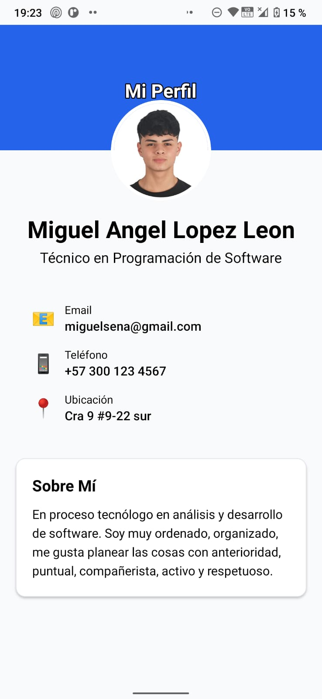

# 📱 Práctica 1 - Perfil Personal Básico

## 👨‍💻 Información del Estudiante
**Desarrollado por:** Miguel Angel Lopez Leon  
**Fecha:** 16 de octubre de 2025  
**Curso:** React Native - Semana 01  
**Práctica:** 1 de 3  

---

## 🎯 Objetivo de la Práctica

Crear una aplicación de **perfil personal básico** utilizando React Native y Expo, implementando las siguientes secciones:

- ✅ **Header azul** con título "Mi Perfil"
- ✅ **Avatar circular** con foto personal
- ✅ **Información personal** (nombre y título profesional)
- ✅ **Datos de contacto** (email, teléfono, ubicación)
- ✅ **Sección "Sobre Mí"** con biografía personal

---

## 📱 Demostración Visual

### 🖼️ **Resultado Final en Dispositivo Móvil**

<div align="center">
  
  
  <p><em>Captura de pantalla de la aplicación funcionando en dispositivo real</em></p>
</div>

**Lo que puedes ver en la captura:**
- 🎨 **Header azul** con título "Mi Perfil" bien posicionado
- 👤 **Avatar circular** con foto personal real superpuesto
- 📝 **Información personal** claramente visible
- 📞 **Datos de contacto** organizados con iconos
- 💭 **Sección "Sobre Mí"** con biografía completa
- 🎯 **Diseño limpio** y profesional

---

## 📱 Resultado de la Implementación

### ✨ **Características Implementadas:**
- **Diseño responsive** con React Native
- **Estilos nativos** para mejor compatibilidad
- **Información personal real** del estudiante
- **Interfaz limpia y profesional**

### 🎨 **Estructura Visual:**
1. **Header azul** - Fondo con título centrado
2. **Avatar superpuesto** - Foto circular con borde blanco
3. **Datos personales** - Nombre y título profesional
4. **Tarjeta de contacto** - Email, teléfono y ubicación
5. **Biografía** - Sección "Sobre Mí" con información personal

---

## 🛠️ Tecnologías Utilizadas

- **React Native** - Framework de desarrollo móvil
- **Expo** - Plataforma de desarrollo y testing
- **TypeScript** - Tipado estático
- **StyleSheet** - Estilos nativos de React Native
- **React Native Safe Area Context** - Manejo de áreas seguras

---

## 📦 Instalación y Ejecución

### Prerrequisitos
- Node.js (versión 16+)
- pnpm o npm
- Expo CLI
- Expo Go (app móvil)

### Pasos para Ejecutar
```bash
# Clonar y navegar al proyecto
git clone https://github.com/MiguelLopez140807/bc-reactnative-semana01-proyecto.git
cd mi-app-personal

# Cambiar a la rama de la práctica 1
git checkout practica-1

# Instalar dependencias
pnpm install
npx expo install react-native-safe-area-context

# Ejecutar la aplicación
pnpm start

# Escanear QR con Expo Go para ver en dispositivo móvil
```

---

## 🔧 Decisión Técnica Importante

### ⚠️ **Migración de Tailwind CSS a Estilos Nativos**

**Problema encontrado:**
Durante el desarrollo inicial se intentó usar NativeWind (Tailwind para React Native), pero se presentaron errores de compatibilidad con Babel:

```
ERROR [BABEL] .plugins is not a valid Plugin property
```

**Solución implementada:**
Se migró completamente a **React Native StyleSheet** por las siguientes razones:

- ✅ **Mayor estabilidad** y compatibilidad
- ✅ **Mejor rendimiento** sin procesamiento adicional
- ✅ **Debugging más efectivo** con herramientas nativas
- ✅ **Código más predecible** y mantenible

Esta decisión técnica resultó en una aplicación más robusta y profesional.

---

## 📁 Estructura del Proyecto

```
practica-1/
├── App.tsx              # Componente principal de la práctica
├── package.json         # Dependencias del proyecto
├── babel.config.js      # Configuración de Babel
├── screenshots/         # Recursos de imágenes
│   └── mi_foto.jpg      # Foto personal del estudiante
└── README.md           # Esta documentación
```

---

## 💡 Características del Código

### 📋 **App.tsx - Componente Principal**
- **Estructura simple** y clara
- **Estilos organizados** en StyleSheet
- **Información personalizada** del estudiante
- **Diseño responsive** y profesional

### 🎨 **Estilos Implementados**
- **Header:** Fondo azul (#2563eb) con título blanco
- **Avatar:** Imagen circular 128x128px con borde blanco
- **Tarjetas:** Fondo blanco con sombras y bordes redondeados
- **Tipografía:** Tamaños y pesos consistentes
- **Colores:** Paleta profesional en grises y azules

---

## 📞 Información de Contacto

- **Email:** miguelsena@gmail.com
- **Ubicación:** Cra 9 #9-22 sur
- **GitHub:** [MiguelLopez140807](https://github.com/MiguelLopez140807)

---

## 🔗 Enlaces Relacionados

- **📁 Repositorio Completo:** [Ver proyecto principal](https://github.com/MiguelLopez140807/bc-reactnative-semana01-proyecto)
- **🌿 Otras Prácticas:** Revisar rama `main` para ver organización completa
- **📋 Código Fuente:** El archivo principal es `App.tsx`

---

*Práctica 1 completada - Miguel Angel Lopez Leon - Octubre 2025*